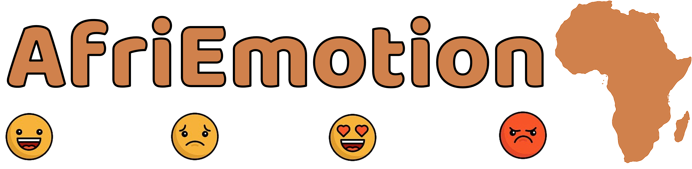

  

  <h1 align="center">Emotion Detection Dataset for African Languages</h1>

# Project Description

Emotion is a universal human phenomenon that affects our communication, behavior, and cognition. However, emotion expression and perception can vary across different languages and cultures. Therefore, it is important to study how emotion is conveyed and understood in different languages, especially in low-resource languages that have limited or no available resources for natural language processing (NLP).

In this project, we aim to collect and annotate emotion in texts for African languages, which are among the most diverse and under-resourced languages in the world. We will use various sources of text data, such as news articles, social media posts, literary works, and oral narratives, to cover a range of domains, genres, and styles. We will also use a comprehensive and consistent emotion annotation scheme, based on the six basic emotions (anger, disgust, fear, happiness, sadness, and surprise), to label the texts with their corresponding emotion categories.

The main objectives of this project are:

- To create a large and high-quality emotion dataset for African languages, which can be used for various NLP tasks, such as emotion detection, emotion generation, emotion analysis, and emotion synthesis.
- To investigate the similarities and differences of emotion expression and perception across different African languages and cultures, and to identify the linguistic and cultural factors that influence them.
- To develop and evaluate NLP models and methods for emotion processing in African languages, and to explore the challenges and opportunities of cross-lingual and multilingual emotion processing.

This project will contribute to the advancement of NLP research and applications for African languages, and to the understanding of emotion as a universal and diverse human phenomenon.

# Languages and Coordinators
----------------
| # | Language | Country | Language Coordinators|
|----------|-----------|----------|-----------------|
| 1. | Hausa | Nigeria | |
| 2. | Yoruba | Nigeria | |
| 3. | Igbo | Nigeria | |
| 4. | Nigerian-Pidgin | Nigeria | |
| 5. | Amharic | Ethiopia | |
| 6. | Tigrinya | Ethiopia | |
| 7. | Oromo | Ethiopia |  |
| 8. | Somali | Ethiopia |  |
| 9. | Twi | Ghana | |
| 10. | Swahili | Kenya | |
| 11. | Moroccan Arabic | Morocco |  |
| 12. | Mozambican Portuguese | Mozambique |  |
| 13. | Kinyarwanda | Rwanda |  |
| 14. | isiZulu | South Africa | |
| 15. | Afrikaans | South Africa | |
| 16. | isiXhosa | South Africa |  |
| 17. | Sudanese Arabic | Sudan |  |
| 18. | Algerian Arabic | Algeria |  |

# Team 

This is a collaborative project with team members from different universities, institutions, and the industry. Team members include:

----------------

| Name | Affiliation|
|----------|-----------------|
| Shamsudden Muhammad  | Bayero University, Kano Nigeria; MasaKhane |
| Esubalew Alemneh 	| Bahir Dar University, Bahir Dar, Ethiopia |
| Ibrahim Said Ahmad  |  Northeastern University; Bayero University Kano; MasaKhane |
| Seid Muhie Yimam  | University of Humberg; MasaKhane |
| Idris Abdulmumin  | Ahmadu Bello University, Zaria, Nigeria |
| Abinew Ali |  Bahir Dar University |
| David Ifeoluwa Adelani | MasaKhane; Saarland University   |
| Saminu Aliyu  | Bayero University, Kano; MasaKhane |
| Nedjma Ousidhoum | University of Cambridge|

